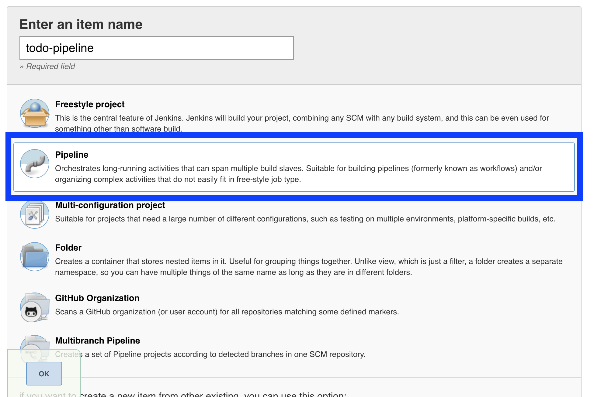

# Using External Jenkins

## Assumptions
- You have an existing Jenkins installation that is hosted outside of OpenShift.
- You have read the [Using CICD Pipeline Part 2](using_cicd_pipeline_part2.md) and are interested to know how the same setup can be run using an external hosted jenkins.

## Install the Jenkins Pipeline Plugin
- Login as admin to jenkins
- Go to Manage Jenkins->Manage Plugins->Available
- Find "OpenShift Pipeline Jenkins Plugin"
- Install it.

## Create the Jenkins Service Account
- Make sure you're in the correct project

```
oc project todo-dev
```

- In your project create a service account named jenkins (if not existing already)
```
oc create sa jenkins
```
- Give edit role to jenkins
```
oc policy add-role-to-user edit -z jenkins
```

## <a name="token_value"></a>Get the token of Jenkins
- Get token name of Jenkins
```
[bobby@bcorpus2 ~]$ oc describe sa jenkins
Name:		jenkins
Namespace:	todo-dev
Labels:		<none>
Annotations:	<none>

Image pull secrets:	jenkins-dockercfg-97wdd

Mountable secrets: 	jenkins-token-wcccq
                   	jenkins-dockercfg-97wdd

Tokens:            	jenkins-token-vx9gj
                   	jenkins-token-wcccq

Events:	<none>
```

- Copy one of the tokens, say 'jenkins-token-vx9gj' and execute command
```
oc describe secret jenkins-token-vx9gj
```
This will give you the token value. Take note of it.

## Copy the certificate to the Jenkins Server
- In the OpenShift server
```
cat /var/lib/origin/openshift.local.config/master/ca.crt
```
Copy the contents.
- In the Jenkins Server, create a file /path/to/ca.crt and paste the contents that you copied above.

## Create a Jenkins Pipeline
- In Jenkins, create a new Item
- Give it a name "todo-pipeline"
- Click on "Pipeline" as shown below



- Click "This project is parametrized"
- Add the following String parameters
  - tag
  - commit
  - apiUrl
    - default value: The url of your openshift master, for example, https://10.1.2.2:8443
  - authToken
    - default value : The token which you got [above](#token_value)
  - namespace 
    - default value: todo-dev
  - CA_CERT_FILE
    - default value: /path/to/ca.crt
- Click OK
- Add the following "String" parameters
  - tag
  - commit
## At this point, the rest of the steps should be the same as the instructions in [using_cicd_pipeline_part2](using_cicd_pipeline_part2.md)
