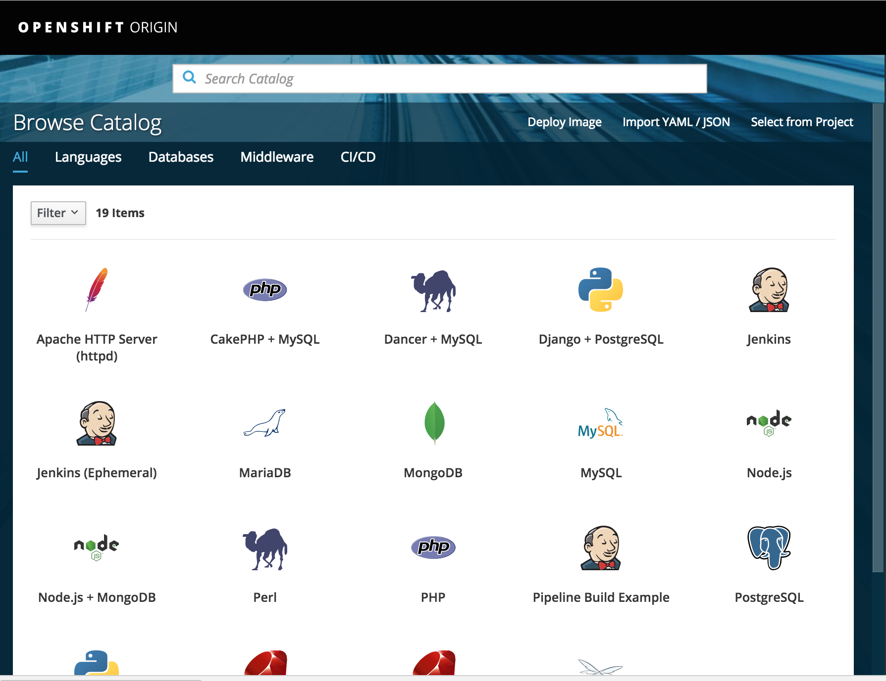
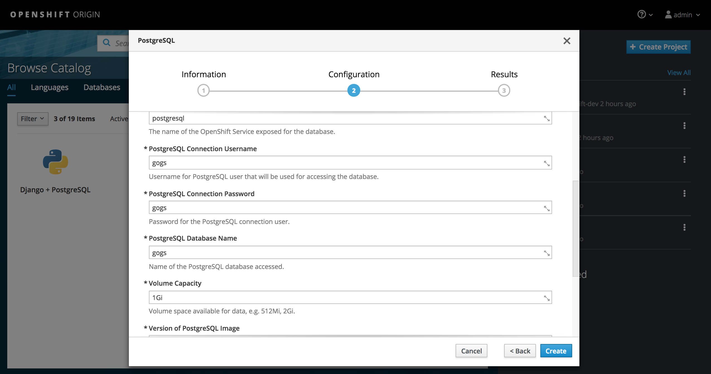

# Adding a Database Using Templates
## Browse the catalog and look for PostgreSQL database

While inside the project userX-dev, browse the catalog and search for postgresql.


## Set the following required input fields to 'gogs'
- PostgreSQL Connection Username
- PostgreSQL Connection Password
- PostgreSQL Database Name


## Click on Create. 
This will create the PostgreSQL database container and run it. It will also request for a persistent volume where it can persist the data across restarts.

To get information on the persistent volume that was created, enter the command below in your console.

```
[root@bcorpus2 exercise1]# oc get pvc
NAME         STATUS    VOLUME    CAPACITY   ACCESSMODES   STORAGECLASS   AGE
postgresql   Bound     pv0073    100Gi      RWO,ROX,RWX                  58s
```

Next Exercise: [Running your own Git Service](03_running_your_own_git_service.md)
