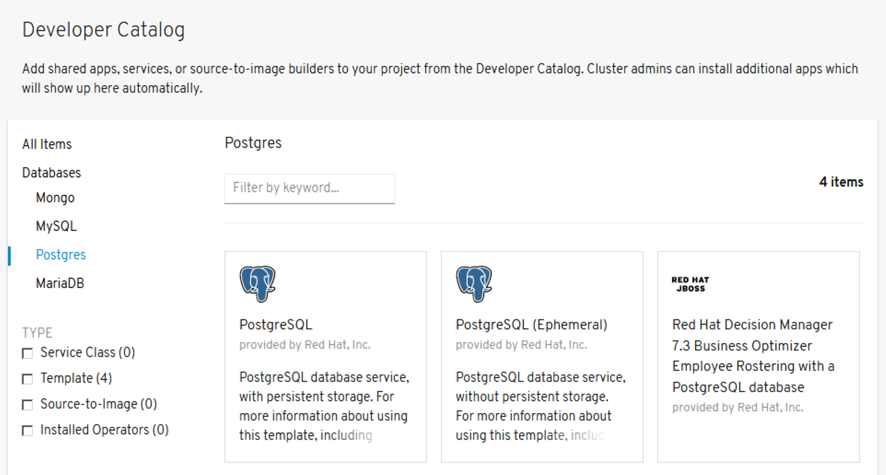
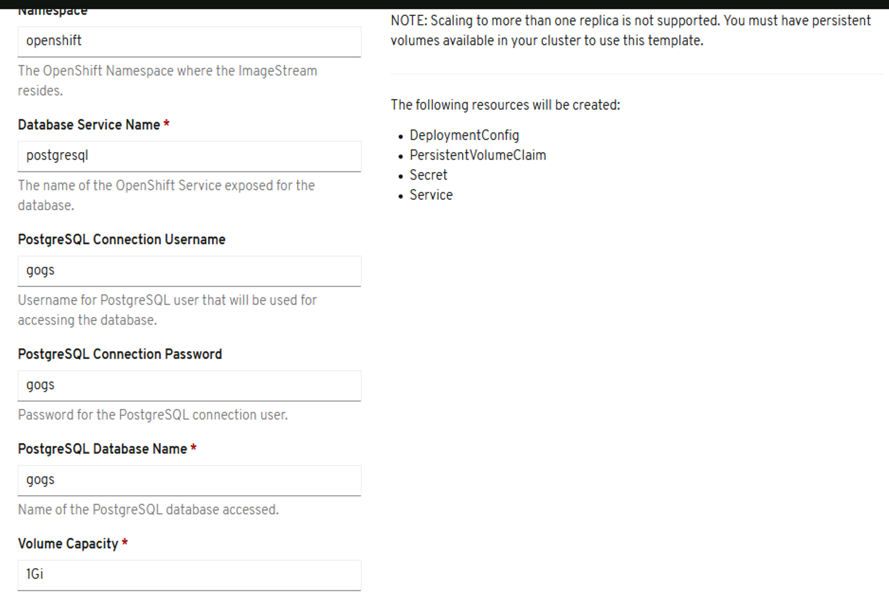

# Adding a Database Using Templates
## Browse the catalog and look for PostgreSQL database

Now delete the project tomcatX, where X is your user number.

```
oc delete project tomcatX
```

Create a new project called userX-dev:

```
oc new-project userX-dev
```

While inside the project userX-dev, click on +Add. At the left hand navigation bar, click on Databases->Postgres. Click on PostgreSQL.



Click "Instantiate Template" 
## Set the following required input fields to 'gogs'
- PostgreSQL Connection Username
- PostgreSQL Connection Password
- PostgreSQL Database Name


## Click on Create. 
This will create the PostgreSQL database container and run it. It will also request for a persistent volume where it can persist the data across restarts.

To get information on the persistent volume that was created, enter the command below in your console.

```
$ oc get pvc
NAME           STATUS   VOLUME                                     CAPACITY   ACCESS MODES   STORAGECLASS   AGE
postgresql     Bound    pvc-37041628-0b4b-11ea-87dc-0050569feae6   1Gi        RWO            thin           8s
```

Next Exercise: [Running your own Git Service](03_running_your_own_git_service.md)
