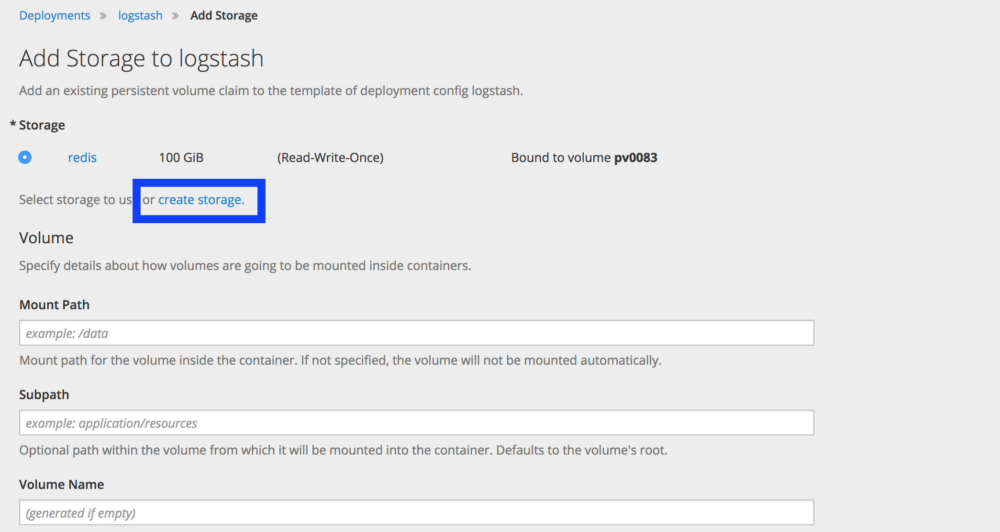
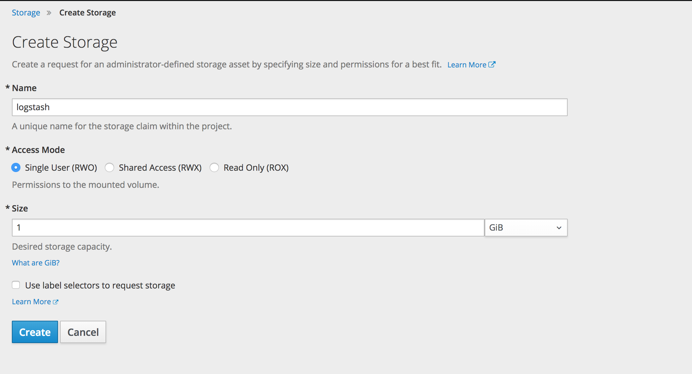

# Install LogStash

```
oc new-app docker.elastic.co/logstash/logstash:6.1.2
```

## Add storage to LogStash

- Go to Applications->Deployments->Logstash
- Click on Configuration->Add Storage
- Click on create storage



- Set the following parameters
  - Name: logstash
  - Access Mode: RWO
  - Size: 1 GiB
- Click on Create





