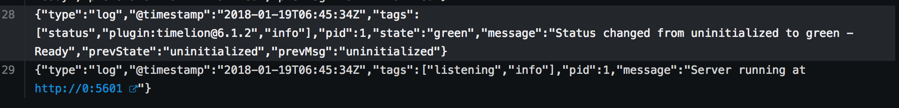

# Install Kibana
## Since Kibana image from elastic.co runs as root, we need to give it permission to do so

```
oc adm policy add-scc-to-user anyuid -z default
```

## Run the Kibana docker image
```
oc new-app docker.elastic.co/kibana/kibana:6.1.2
```

- Go to Applications->Pods
- Click the kibana pod
- Click Logs
- At the bottom, you should be able to see the following



