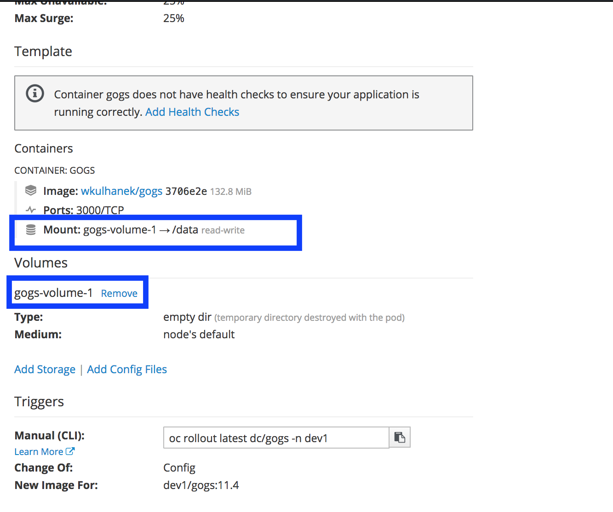
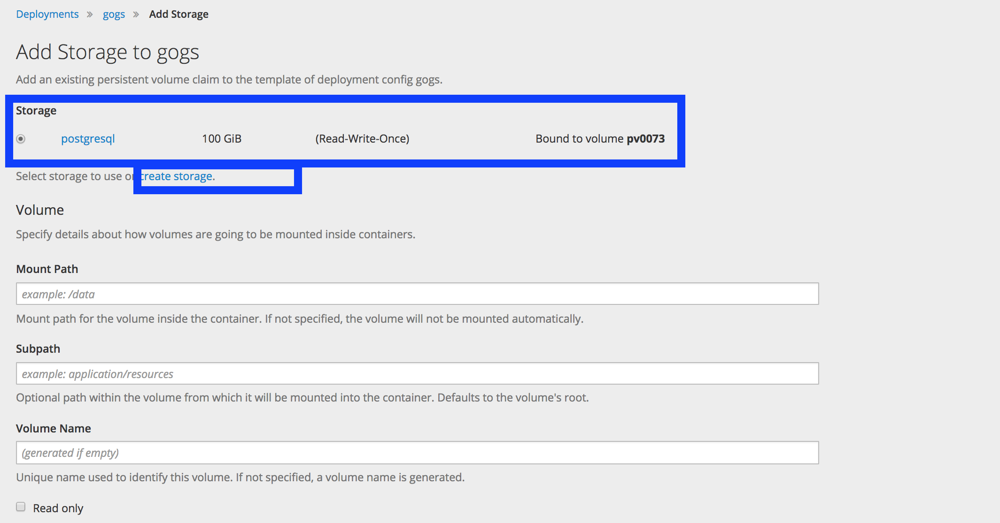
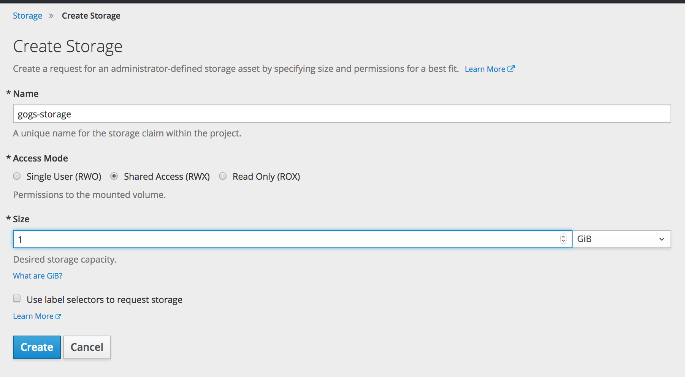
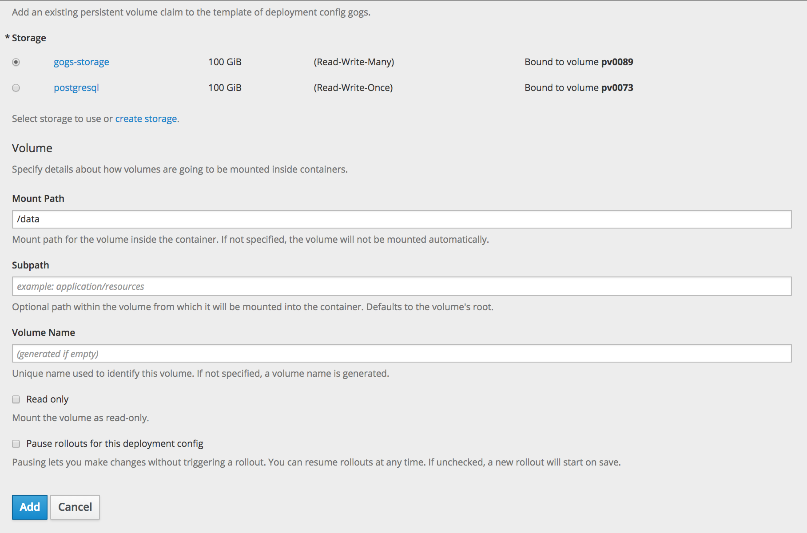
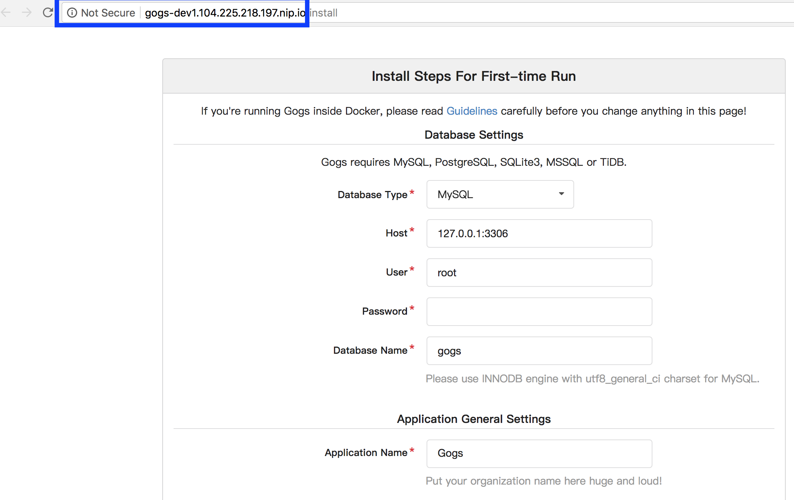

# Running your own Git Service 
## Run the Go Git Service image using the command below

```
oc new-app wkulhanek/gogs:11.86
```

## Attach storage to gogs and mount to /data

We are going to replace the "non-persistent" volume mounted on /data and change it to a persistent volume. Go to Applications->Deployments->gogs->Configuration. Scroll down to volumes and delete the volume mounted on /data.



Click on Add Storage. 



You'll notice there is only one storage and it's already claimed by another container. We need to create another storage. Click on 'create storage' and input the following details as show below:



Mount gogs-storage to /data and click Add



Doing it by commandline:

- Get the name of the volume
```
oc set volume dc/gogs
deploymentconfigs/gogs
  empty directory as gogs-volume-1
    mounted at /data
```

- Remove the volume from the DeploymentConfig
```
oc set volume dc/gogs --remove --name gogs-volume-1
```
- Request for a PersitentVolume by creating a persistent volume claim. Create a file named pvc.yaml with the following contents:

```
apiVersion: v1
kind: PersistentVolumeClaim
metadata:
  labels:
    app: gogs
  name: gogs-storage
spec:
  accessModes:
  - ReadWriteOnce
  resources:
    requests:
      storage: 1Gi
```

Import this into the OKD cluster:

```
oc create -f pvc.yaml
```

If you query for the pvc using the command

```
oc get pvc
```

you will get something like:

```
NAME           STATUS   VOLUME   CAPACITY   ACCESS MODES   STORAGECLASS   AGE
gogs-storage   Bound    pv-59    100Gi      RWO,ROX,RWX                   15s
```

- Mount this volume to the deployment config

```
oc set volume dc/gogs --add --type persistentVolumeClaim --claim-name gogs-storage --mount-path /data --name gogs-storage
```
# Expose the gogs service 


Type the following command to create a route for the gogs service.

```
oc expose svc gogs
```

## Configure the gogs database by accessing the gogs url. TODO: Add detailed steps.
Click on the gogs url to open the gogs service.



Set the following parameters to the following values:
- Database Type = Postgresql
- Host = postgresql:5432
- User = gogs
- Password = gogs
- Database Name = gogs
- Run User = gogs

Set the application url to the url of gogs.

Click on Install Gogs. You will get the following page


In the next exercise, we will learn how to externalize configuration using ConfigMaps

Next Exercise: [Using ConfigMaps](04_using_config_maps.md)
