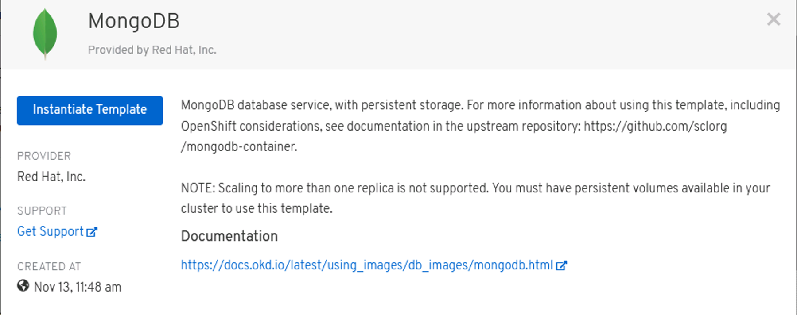
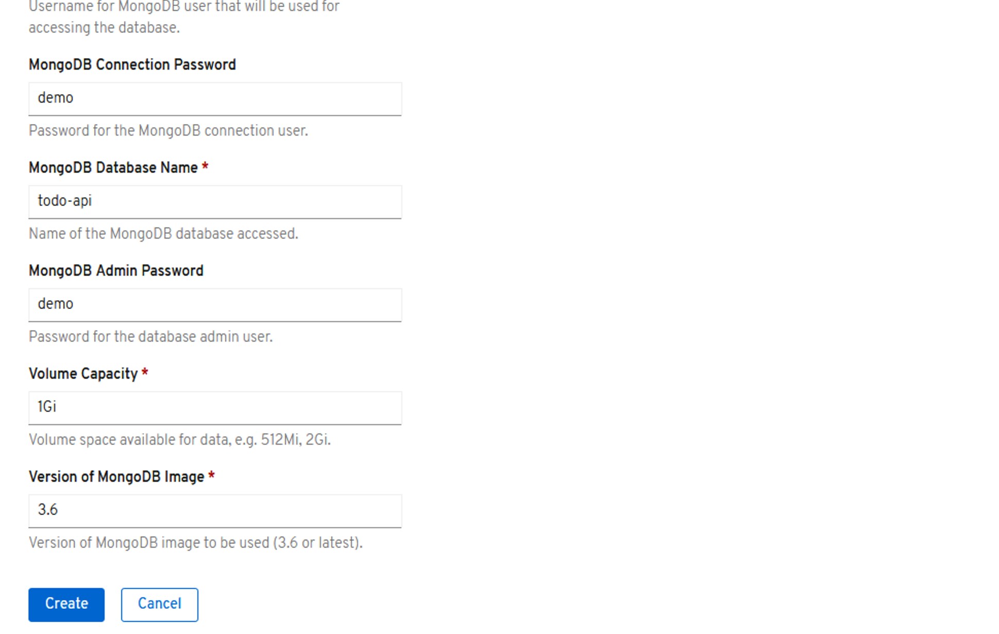
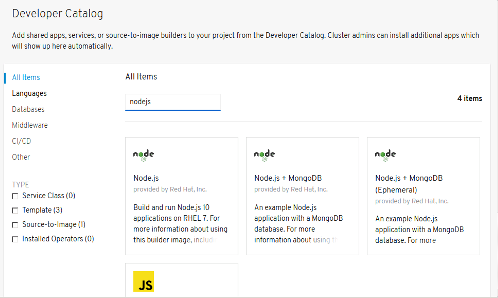
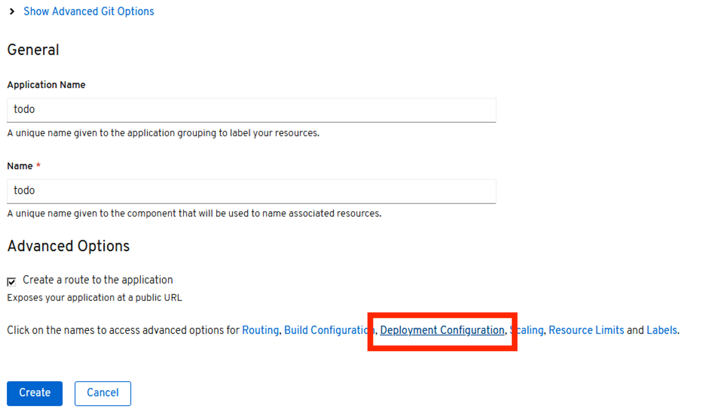
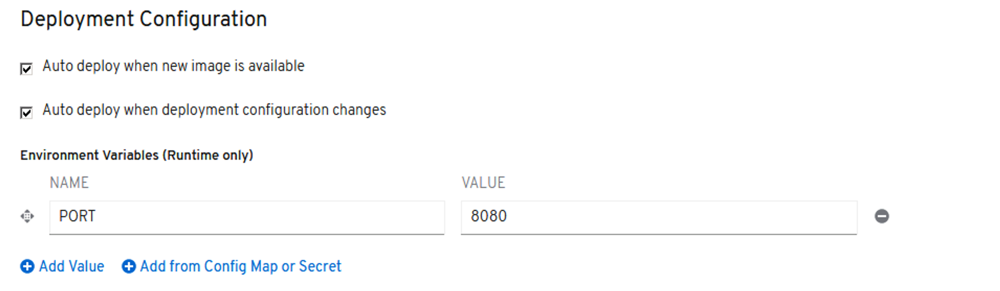
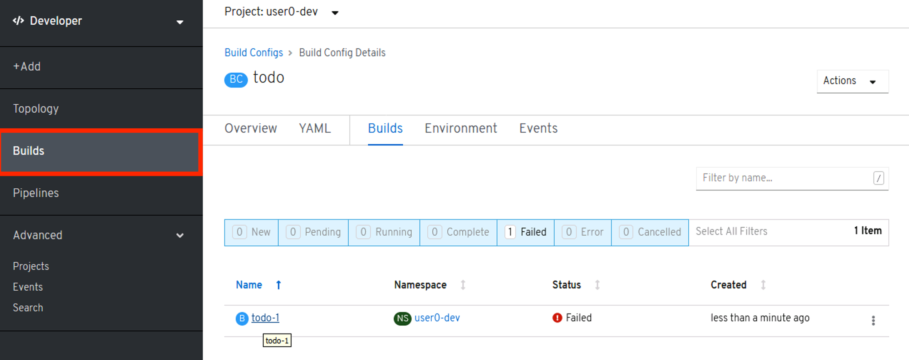
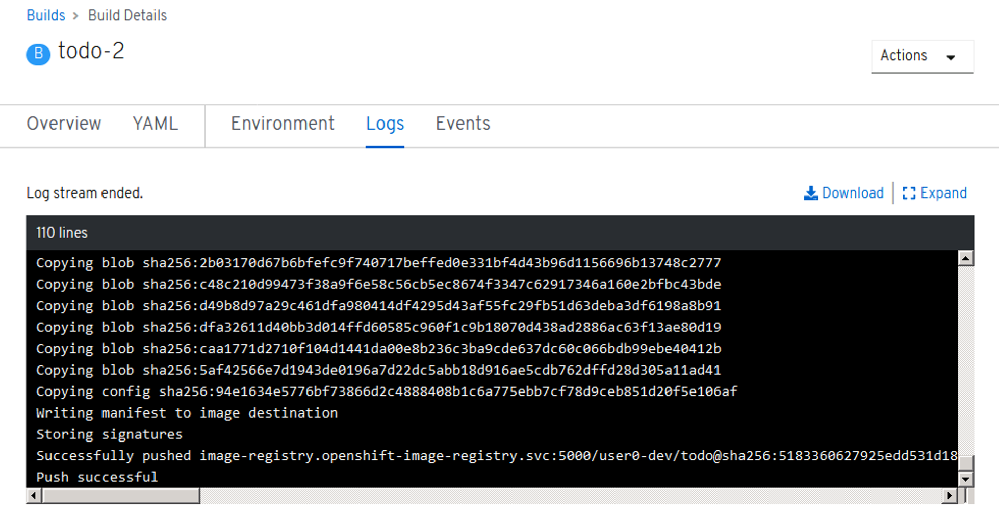
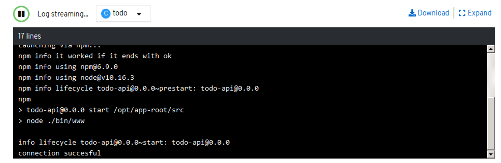
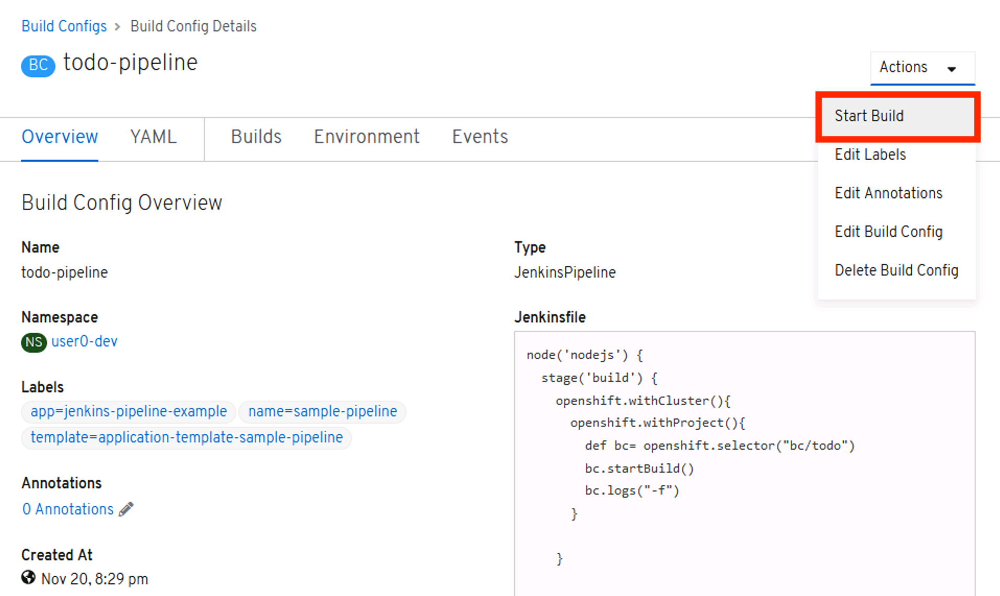

# Using Jenkins Pipeline

## Register to Gogs 

First we need to register to Gogs as a developer. For uniformity, we use the following convention:

*Important: Use the correct value of userX*

username: userX
email: userX@example.com
password: userX


## Create a new Repository

Click the + sign of My Repositories. Set the following details:

- Repository Name = todoAPIjs
- Visibility = Private

Click Create Repository


Copy the new repository url to the clipboard


## Import source code to the Repository

- Clone the application https://github.com/corpbob/todoAPIjs.git
```
git clone https://github.com/corpbob/todoAPIjs.git
```
- Add a new remote 
```
cd todoAPIjs
git remote add gogs <your gogs todoAPIjs repository url>
git push gogs master
```
You should be able to see something like this


## Create a Mongodb database instance using Mongodb template

- Using the service catalog, search for a mongodb template. 



- Click Instantiate Template
- Set the following parameters to the specified values:

  - Database Service Name = mongodb
  - MongoDB Connection Username = demo
  - MongoDB Connection Password = demo
  - MongoDB Database Name = todo-api
  - MongoDB Admin Password = demo




- Click on Create.

## Create a new application using NodeJs template

Click "+Add", search for NodeJs



Click on Node.js (the one without the mongodb).  Input the Git Repo URL of your gogs git repo. Set the "Application Name" and "Name" to "todo".




Click on "Deployment Configuration". Add Environment Variable

```
PORT = 8080
```



Click on Create.

The build will fail in this case because the repository is private.

## Add Gogs credentials to your OpenShift project




You can view the logs from the pod. Go to Search->Pod. Click the todo pod. 


- Make sure you are in the correct project

```
oc project
```

- Create basic secret by specifying your username and password to gogs. In the command below, substitute your gogs username and gogs password.
```
oc secrets new-basicauth  gogs-secret --username=<your gogs username> --password=<your gogs password>
```
Configure the deployment config to use this secret. 

```
oc set build-secret --source bc/todo gogs-secret
```

Then start the build

```
oc start-build bc/todo
```

You can also view the build logs:


- Wait for the build to complete. The build will complete when the image build is pushed to the internal container registry.
- This will automatically deploy the todo application. Go to Search-Pods. Click on the todo pod. Click on Logs and you should see something like



- Go to Search->Route. Click on the todo url and you should be able to see something like this


## Install Jenkins

- By now, you should already know how to provision a Jenkins application using the Application Catalog. Go ahead and provision a Jenkins Ephemeral application.

## Create the Build Pipeline

- Copy the following pipeline definition to a file todo_pipeline.yml

```
apiVersion: v1
kind: BuildConfig
metadata:
  labels:
    app: jenkins-pipeline-example
    name: sample-pipeline
    template: application-template-sample-pipeline
  name: todo-pipeline
spec:
  runPolicy: Serial
  strategy:
    jenkinsPipelineStrategy:
      jenkinsfile: |-
        node('nodejs') {
          stage('build') {
            openshift.withCluster(){
              openshift.withProject(){
                def bc= openshift.selector("bc/todo")
                bc.startBuild()
                bc.logs("-f")
              }
            }
          }
        }
    type: JenkinsPipeline
  triggers:
  - github:
      secret: secret101
    type: GitHub
  - generic:
      secret: secret101
    type: Generic
```
- Import this definition to the todo-dev project.

```
oc create -f todo_pipeline.yml
```
- This will use the Jenkins you just installed to run the pipeline.

- Go to Builds->todo-pipeline. You should be able to see something like this:



- At this point, you can do the following:
  - View Jenkinsfile
  - Start Pipeline using Actions->Start Build
  - View the Jenkins Log as the build progresses
  - View the Deployment after the build

Next Exercise: [Configure the CI/CD pipeline](06_configure_cicd.md)
