# Using Jenkins Pipeline

## Register to Gogs 

First we need to register to Gogs as a developer. For uniformity, we use the following convention:

*Important: Use the correct value of userX*

username: userX
email: userX@example.com
password: userX

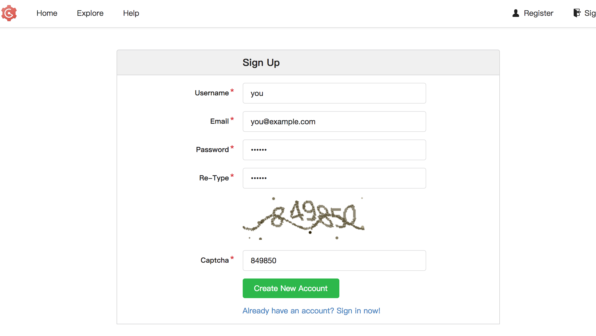

## Create a new Repository

Click the + sign of My Repositories. Set the following details:

- Repository Name = todoAPIjs
- Visibility = Private

Click Create Repository

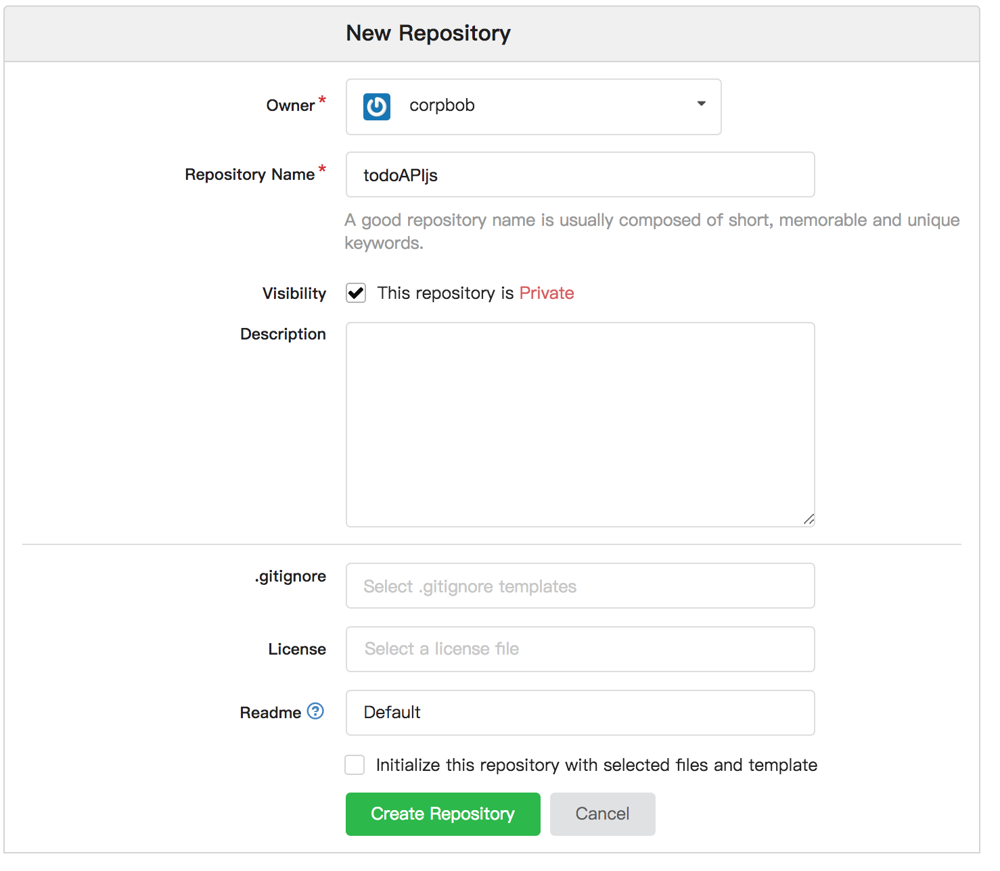

Copy the new repository url to the clipboard

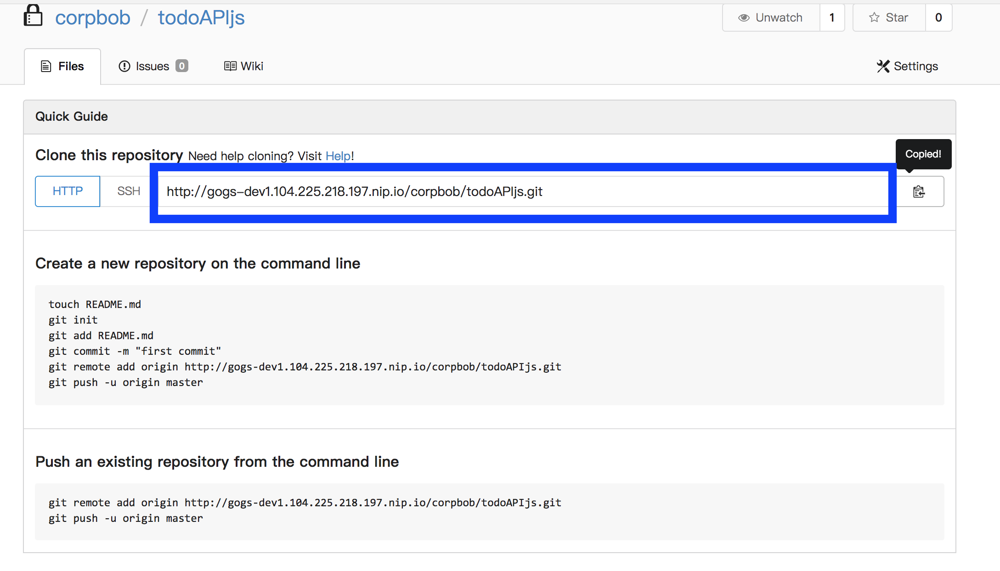

## Import source code to the Repository

- Clone the application https://github.com/corpbob/todoAPIjs.git
```
git clone https://github.com/corpbob/todoAPIjs.git
```
- Add a new remote 
```
cd todoAPIjs
git remote add gogs <your gogs todoAPIjs repository url>
git push gogs master
```
You should be able to see something like this

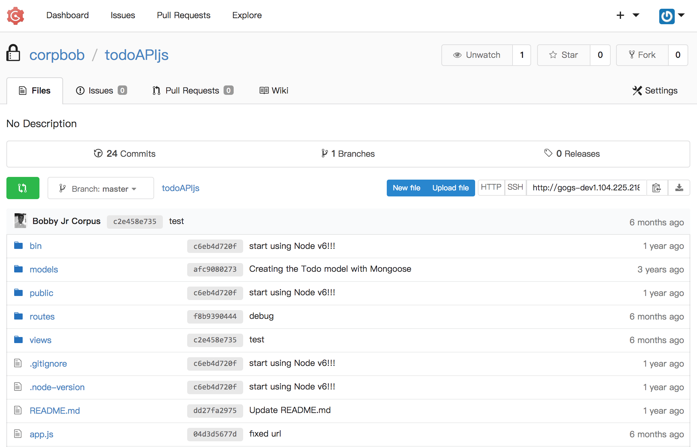

## Create a Mongodb database instance using Mongodb template

- Using the service catalog, search for a mongodb template. 

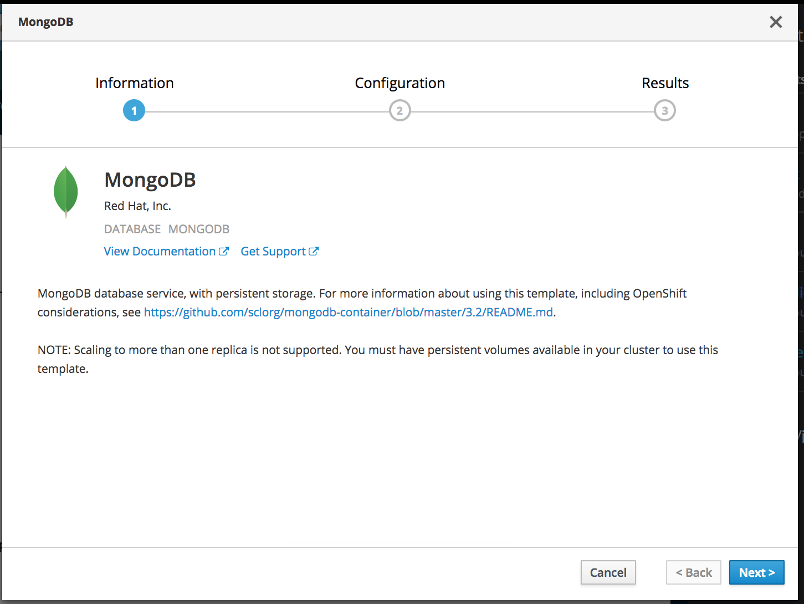
- Set the following parameters to the specified values:

  - Database Service Name = mongodb
  - MongoDB Connection Usernae = demo
  - MongoDB Connection Password = demo
  - MongoDB Database Name = todo-api
  - MongoDB Admin Password = demo


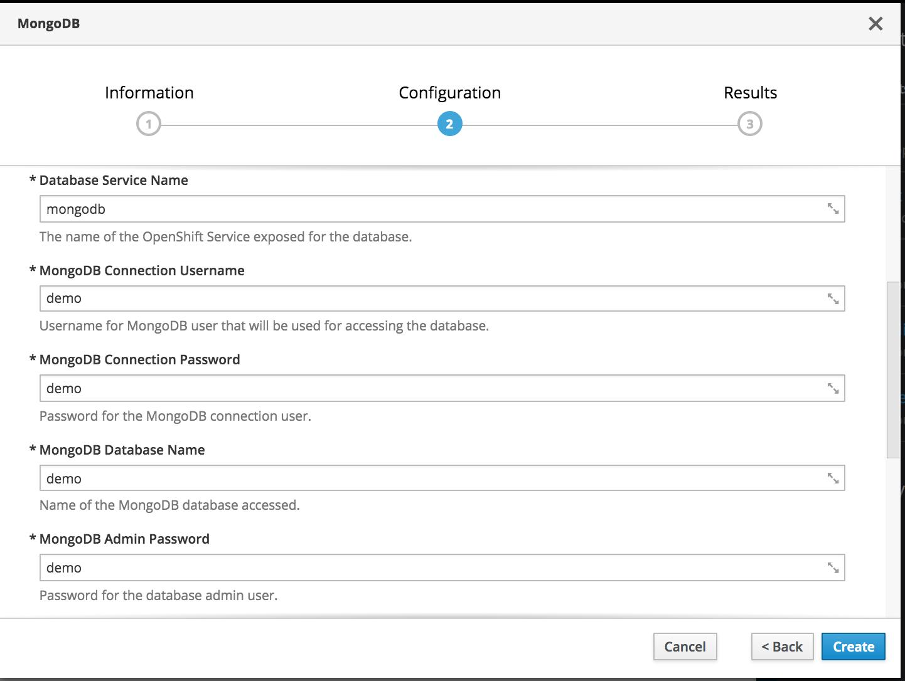

- Click on Create.

## Create a new application using NodeJs template

Click "Add to Project", search for NodeJs

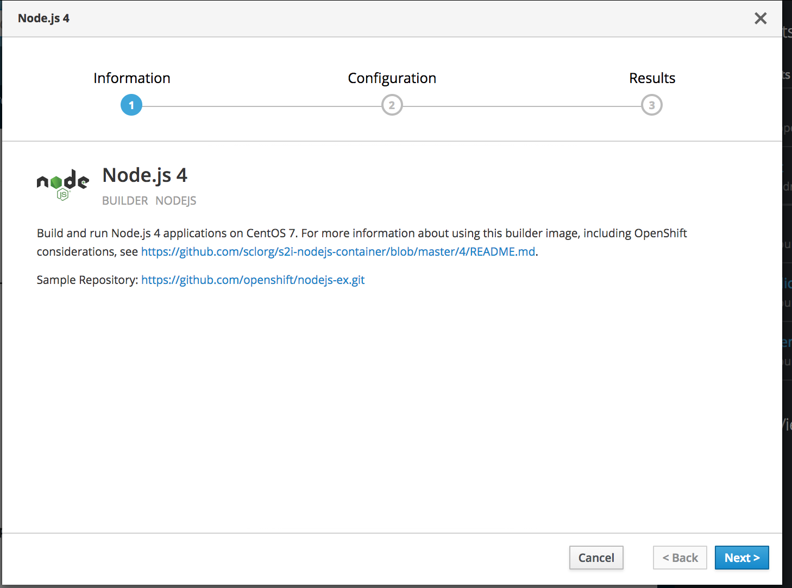

Input the details as shown below. The project should be the project assigned to you.

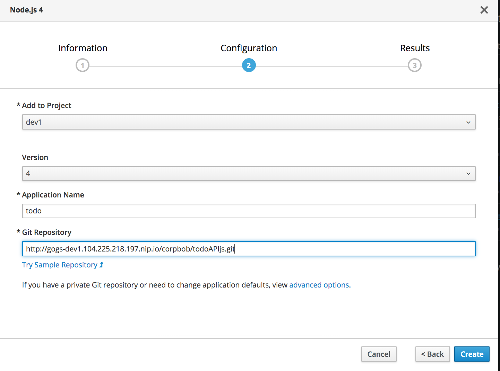

Click on "advanced options". Scroll to Deployment Configuration and add Environment Variable

```
PORT = 8080
```

Click on Create.

The build will fail in this case because the repository is private.

## Add Gogs credentials to your OpenShift project

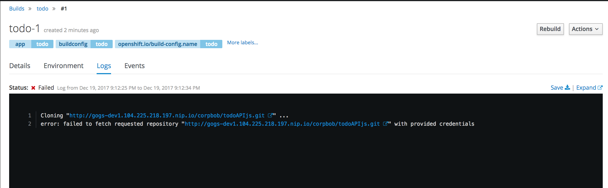

- Make sure you are in the correct project

```
oc project
```

- Create basic secret by specifying your username and password to gogs. In the command below, substitute your gogs username and gogs password.
```
oc secrets new-basicauth  gogs-secret --username=<your gogs username> --password=<your gogs password>
```
Configure the deployment config to use this secret. 

- Go to Builds->Builds->todo

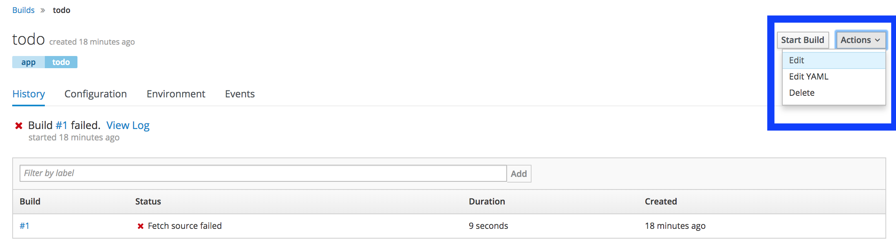

- Click on Advanced Options

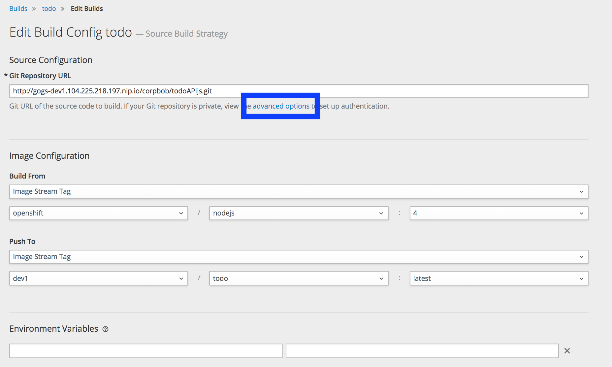

- Set source secret to gogs-secret

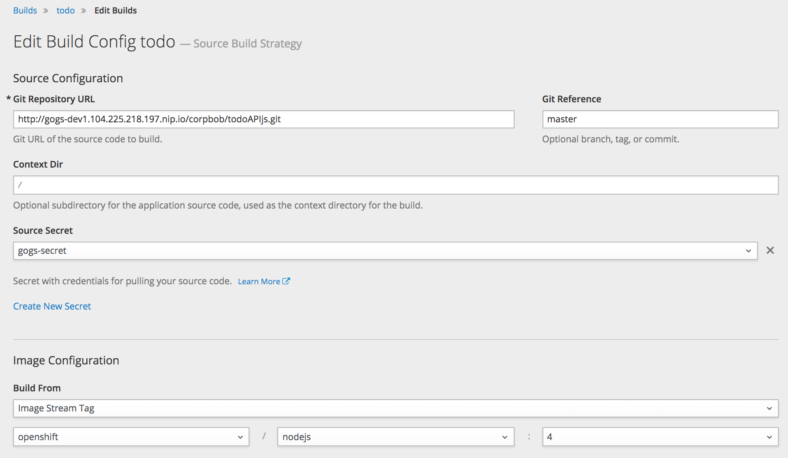

- Click Save 
- Click Start Build

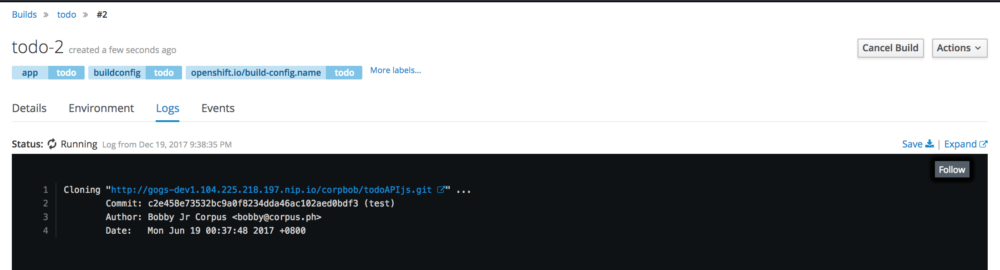
- Wait for the build to complete. The build will complete when the image build is pushed to the internal docker registry.
- This will automatically deploy the todo application. Go to Applications-Pods. Click on the todo pod. Click on Logs and you should see something like

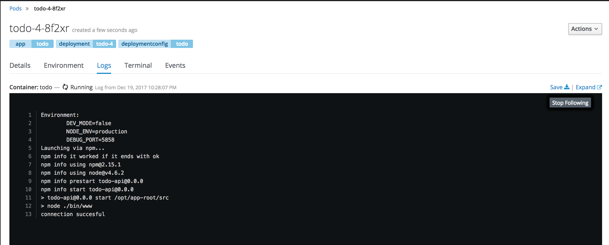

- Click on the todo url and you should be able to see something like this

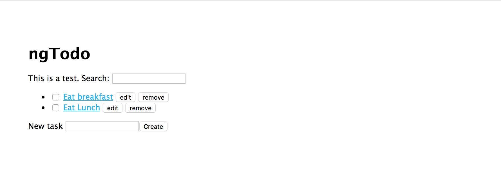

## Create the Build Pipeline

- Copy the following pipeline definition to a file todo_pipeline.yml

```
apiVersion: v1
kind: BuildConfig
metadata:
  labels:
    app: jenkins-pipeline-example
    name: sample-pipeline
    template: application-template-sample-pipeline
  name: todo-pipeline
spec:
  runPolicy: Serial
  strategy:
    jenkinsPipelineStrategy:
      jenkinsfile: |-
        node('nodejs') {
          stage('build') {
            openshiftBuild(buildConfig: 'todo', showBuildLogs: 'true')
          }
          stage('deploy') {
            openshiftDeploy(deploymentConfig: 'todo')
          }
 
          //stage( 'Wait for approval')
          //input( 'Aprove to production?')
          //stage('Deploy UAT'){
            //openshiftDeploy(deploymentConfig: 'todo', namespace: 'todo-uat')
          //}

        }
    type: JenkinsPipeline
  triggers:
  - github:
      secret: secret101
    type: GitHub
  - generic:
      secret: secret101
    type: Generic
```
- Import this definition to the todo-dev project.

```
oc create -f todo_pipeline.yml
```

- Go to Build->Pipelines. You should be able to see something like this:

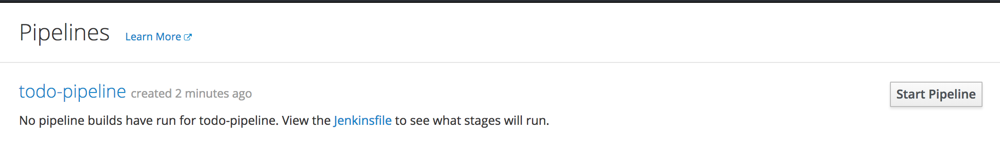

- At this point, you can do the following:
  - View Jenkinsfile
  - Start Pipeline
  - View the Jenkins Log as the build progresses
  - View the Deployment after the build

Next Exercise: [Configure the CI/CD pipeline](06_configure_cicd.md)
