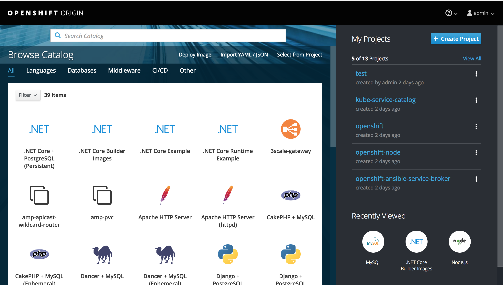

# How to Install OpenShift Enterprise in one node Using Ansible for Development Purposes

## Assumptions:

- RHEL 7.4 operating System running as a VM in virtual box.
- Login to developers.redhat.com. Create an account if you don't have one. Download RHEL 7.4 from here: https://developers.redhat.com/download-manager/content/origin/files/sha256/43/431a58c8c0351803a608ffa56948c5a7861876f78ccbe784724dd8c987ff7000/rhel-server-7.4-x86_64-dvd.iso

## Create a Host-Only Network in VirtualBox
- Navigate to VirtualBox->Preferences


- A dialog box will appear


- Add a host-only network and set it's IP address to 10.1.2.1.


- Click OK

## Install RHEL
- Using VirtualBox, click the Create button


- specify the name. The version should be Red Hat (64-bit)
- Allocate at least 8 GB RAM, 4 CPU


- Configure the Network. Set the first adapter to NAT


- Set the second adapter to the host-only network you created earlier


## Configure RHEL

- Once installation is complete, configure the networking inside RHEL. As root edit the file /etc/sysconfig/network-scripts/ifcfg-enp0s3 and set it to these contents

```
TYPE=Ethernet
BOOTPROTO=dhcp
DEFROUTE=yes
PEERDNS=yes
PEERROUTES=yes
IPV4_FAILURE_FATAL=no
IPV6INIT=yes
IPV6_AUTOCONF=yes
IPV6_DEFROUTE=yes
IPV6_PEERDNS=yes
IPV6_PEERROUTES=yes
IPV6_FAILURE_FATAL=no
IPV6_ADDR_GEN_MODE=stable-privacy
NAME=enp0s3
DEVICE=enp0s3
ONBOOT=yes
ZONE=public
```
- As root create a file /etc/sysconfig/network-scripts/ifcfg-enp0s8 and set it's contents to the below:

```
TYPE=Ethernet
BOOTPROTO=none
IPV4_FAILURE_FATAL=no
IPV6INIT=yes
IPV6_AUTOCONF=yes
IPV6_FAILURE_FATAL=no
IPV6_ADDR_GEN_MODE=stable-privacy
NAME=enp0s8
DEVICE=enp0s8
ONBOOT=yes
IPADDR=10.1.2.2
ZONE=public
```
- reboot the virtual machine to make sure the network settings work. 

```
reboot
```

After the reboot, test if you can ping yahoo.com:

```
[root@openshift sysconfig]# ping yahoo.com
PING yahoo.com (98.139.180.149) 56(84) bytes of data.
64 bytes from ir1.fp.vip.bf1.yahoo.com (98.139.180.149): icmp_seq=1 ttl=63 time=227 ms
64 bytes from ir1.fp.vip.bf1.yahoo.com (98.139.180.149): icmp_seq=2 ttl=63 time=228 ms
^C
--- yahoo.com ping statistics ---
2 packets transmitted, 2 received, 0% packet loss, time 1001ms
rtt min/avg/max/mdev = 227.997/228.146/228.295/0.149 ms
```
- From the host machine, you should be able to ping the VM ip 10.1.2.2. Otherwise, wait awhile, at the VM's Power button, found at the upper right of the console, make sure that the 'Ethernet(enp0s8)' is connected. 

```
Red-Hats-MacBook-Pro:~ bcorpus$ ping 10.1.2.2
PING 10.1.2.2 (10.1.2.2): 56 data bytes
64 bytes from 10.1.2.2: icmp_seq=0 ttl=64 time=0.454 ms
^C
--- 10.1.2.2 ping statistics ---
1 packets transmitted, 1 packets received, 0.0% packet loss
round-trip min/avg/max/stddev = 0.454/0.454/0.454/0.000 ms
```

## Subscribe the system and refresh

```
subscription-manager register 
subscription-manager refresh
```

## Get the subscriptin that has OpenShift Container Platform in it. Choose the subscription where System Type = Virtual
```
subscription-manager list --available --matches '*OpenShift*'
```
##
Attach to the pool id of that subscription
```
subscription-manager attach --pool=<pool id>
```
## Disable all repo
```
subscription-manager repos --disable="*"
```

## Enable the following repo
```
subscription-manager repos     --enable="rhel-7-server-rpms"     --enable="rhel-7-server-extras-rpms"     --enable="rhel-7-server-ose-3.7-rpms"     --enable="rhel-7-fast-datapath-rpms"
```
## Install required packages
```
yum install wget git net-tools bind-utils iptables-services bridge-utils bash-completion kexec-tools sos psacct
```

## Update to the latest versions
```
yum update
```

## Install atomic-openshift-utils
```
yum install atomic-openshift-utils
```

## Install docker

```
yum install -y docker-1.13.1
```
- Edit the file /etc/sysconfig/docker. Modify the line

```
OPTIONS='--selinux-enabled --log-driver=journald --signature-verification=false'
```
to
```
OPTIONS='--selinux-enabled --log-driver=journald --signature-verification=false --insecure-registry 172.30.0.0/16'
```
- restart docker

```
systemctl restart docker
```

## Pre-pull some images

```
docker pull registry.access.redhat.com/openshift3/ose-deployer:v3.7.42
docker pull registry.access.redhat.com/openshift3/ose-haproxy-router:v3.7.42
docker pull registry.access.redhat.com/openshift3/ose:v3.7
docker pull registry.access.redhat.com/openshift3/ose-docker-registry:v3.7.42
docker pull registry.access.redhat.com/openshift3/metrics-hawkular-metrics:v3.7
docker pull registry.access.redhat.com/openshift3/metrics-cassandra:v3.7
docker pull registry.access.redhat.com/openshift3/ose-ansible-service-broker:v3.7
docker pull registry.access.redhat.com/openshift3/ose-pod:v3.7.42
docker pull registry.access.redhat.com/openshift3/registry-console:v3.7
docker pull registry.access.redhat.com/openshift3/metrics-heapster:v3.7
docker pull registry.access.redhat.com/openshift3/ose-service-catalog:v3.7
```
## Make SSH passwordless

- Generate SSH keys

```
[root@localhost ~]# ssh-keygen 
Generating public/private rsa key pair.
Enter file in which to save the key (/root/.ssh/id_rsa): 
Created directory '/root/.ssh'.
Enter passphrase (empty for no passphrase): 
Enter same passphrase again: 
Your identification has been saved in /root/.ssh/id_rsa.
Your public key has been saved in /root/.ssh/id_rsa.pub.
The key fingerprint is:
SHA256:XlB/0nXW9vY/GQq9bcSfXoQGOEreDVFxTQGgAol01Pk root@localhost.localdomain
The key's randomart image is:
+---[RSA 2048]----+
|  ..o+o . oo+oo+B|
|   ....o ..+ o o=|
|       .+.+ + o..|
|       o.E + + .o|
|        S o o +.o|
|       . . . o =.|
|        .   . = B|
|             o *+|
|              o..|
+----[SHA256]-----+
```

- Copy the public key to authorized keys
```
cd ~/.ssh
cp id_rsa.pub authorized_keys
chmod 600 authorized_keys
```
- Verify you can log in without password
```
ssh -v localhost
```

- You should see something like this

```
Are you sure you want to continue connecting (yes/no)?
```
- Type yes. You should then see something like

```
debug1: Sending environment.
debug1: Sending env LANG = en_US.UTF-8
Last login: Fri Apr 13 08:36:56 2018 from 10.1.2.1
[root@localhost ~]# 
```

- Type exit and press enter

```
[root@localhost ~]# exit
logout
debug1: client_input_channel_req: channel 0 rtype exit-status reply 0
debug1: client_input_channel_req: channel 0 rtype eow@openssh.com reply 0
debug1: channel 0: free: client-session, nchannels 1
Connection to localhost closed.
Transferred: sent 3280, received 2988 bytes, in 116.8 seconds
Bytes per second: sent 28.1, received 25.6
debug1: Exit status 0
```

## Customize Ansible Hosts file

*Adapted from https://raw.githubusercontent.com/sjbylo/misc/master/ocp-install-39/create-hosts*

- Edit the file /etc/ansible/hosts. Replace the contents with the following:

```
# Create an OSEv3 group that contains the master, nodes, etcd, and lb groups.
[OSEv3:children]
masters
etcd
nodes

# Set variables common for all OSEv3 hosts
[OSEv3:vars]
openshift_enable_docker_excluder=False
openshift_enable_openshift_excluder=False
ansible_ssh_user=root
ansible_become=true
openshift_deployment_type=openshift-enterprise
#debug_level=4
openshift_clock_enabled=true

openshift_master_identity_providers=[{'name': 'htpasswd_auth', 'login': 'true', 'challenge': 'true', 'kind': 'HTPasswdPasswordIdentityProvider', 'filename': '/etc/origin/openshift-passwd'}]

# Create dev and admin users
openshift_master_htpasswd_users={'dev': '$apr1$LcfsxR41$zY2JK4Bg9gXeBDKXiokRZ1', 'admin': '$apr1$f4jGxBUp$TMIBlmIVoVf9PKHWoL4w8.'}

# apply updated node defaults
openshift_node_kubelet_args={'pods-per-core': ['10'], 'max-pods': ['250'], 'image-gc-high-threshold': ['80'], 'image-gc-low-threshold': ['60']}

# AWS related configuration

#openshift_cloudprovider_kind=aws
#openshift_clusterid=cluster01   # Set this to the id of the cluster (need to tag ec2 resources) 

#openshift_cloudprovider_aws_access_key="{{ lookup('env','AWS_ACCESS_KEY_ID') }}"
#openshift_cloudprovider_aws_secret_key="{{ lookup('env','AWS_SECRET_ACCESS_KEY') }}"

# If using S3 for the Docker registry, S3 bucket must already exist.
# These vars are required 
# https://docs.docker.com/registry/storage-drivers/s3/ 
#openshift_hosted_registry_storage_kind=object
#openshift_hosted_registry_storage_provider=s3
#openshift_hosted_registry_storage_s3_bucket=ocp-registry
#openshift_hosted_registry_storage_s3_region=ap-southeast-1

# These vars are optional
#openshift_hosted_registry_storage_s3_encrypt=false
#openshift_hosted_registry_storage_s3_kmskeyid=aws_kms_key_id
#openshift_hosted_registry_storage_s3_accesskey=aws_access_key_id
#openshift_hosted_registry_storage_s3_secretkey=aws_secret_access_key
#openshift_hosted_registry_storage_s3_chunksize=26214400
#openshift_hosted_registry_storage_s3_rootdirectory=/registry
#openshift_hosted_registry_pullthrough=true
#openshift_hosted_registry_acceptschema2=true
#openshift_hosted_registry_enforcequota=true

osm_default_node_selector='env=dev'
openshift_hosted_metrics_deploy=true
#openshift_hosted_logging_deploy=true

# Disable some pre-flight checks 
openshift_disable_check=memory_availability,disk_availability,package_version,docker_image_availability,package_availability,package_update

# default subdomain to use for exposed routes
openshift_master_default_subdomain=apps.10.1.2.2.nip.io

# Set the port of the master (default is 8443) if the master is a dedicated host
#openshift_master_api_port=443
#openshift_master_console_port=443

# default project node selector
osm_default_node_selector='env=dev'

# Router selector (optional)
openshift_hosted_router_selector='env=dev'
openshift_hosted_router_replicas=1

# Registry selector (optional)
openshift_registry_selector='env=dev'

# Configure metricsPublicURL in the master config for cluster metrics
#openshift_master_metrics_public_url=https://hawkular-metrics.public.10.1.2.2.nip.io

# Configure loggingPublicURL in the master config for aggregate logging
#openshift_master_logging_public_url=https://kibana.10.1.2.2.nip.io

# host group for masters
[masters]
master.10.1.2.2.nip.io

# host group for etcd
[etcd]
master.10.1.2.2.nip.io

# host group for nodes, includes region info
[nodes]
master.10.1.2.2.nip.io openshift_public_hostname="master.10.1.2.2.nip.io"  openshift_schedulable=true openshift_node_labels="{'name': 'master', 'region': 'infra', 'env': 'dev'}" ansible_connection=local

```

*Note: dev password is dev, admin password is admin*

## Install OpenShift

```
ansible-playbook -i /etc/ansible/hosts /usr/share/ansible/openshift-ansible/playbooks/byo/config.yml
```
### If you encounter an error like: No package matching 'xxx' found available, installed or updated", then run again

```
subscription-manager repos     --enable="rhel-7-server-rpms"     --enable="rhel-7-server-extras-rpms"     --enable="rhel-7-server-ose-3.7-rpms"     --enable="rhel-7-fast-datapath-rpms"
```
It's possible that these repositories were disabled during the installation.
- Run the playbook again
```
ansible-playbook -i /etc/ansible/hosts /usr/share/ansible/openshift-ansible/playbooks/byo/config.yml
```

### If you encounter an error like: Could not resolve host: xxx; Unknown error

- It's possible that the installer has affected the name resolution. Reboot the system

```
reboot
```

- run the playbook again

### If you encounter an error like: Failed connect to apiserver.openshift-template-service-broker.svc:443; Connection refused"

- run the playbook again

## If the installation completed without errors, you will see something like this:

```
INSTALLER STATUS *********************************************************************************************************************************************
Initialization             : Complete
Health Check               : Complete
etcd Install               : Complete
Master Install             : Complete
Master Additional Install  : Complete
Node Install               : Complete
Hosted Install             : Complete
Metrics Install            : Complete
Service Catalog Install    : Complete

```

- Login as system:admin
```
oc login -u system:admin
```

- Add admin user to admin role so that all projects will be visible in the web console.

```
oc adm policy add-cluster-role-to-user cluster-admin admin
```
- Login as admin. Password is admin

```
oc login -u admin
```

- Navigate to the web console at https://10.1.2.2:8443 and login with the credentials

```
username: admin
password: admin
```
You should be able to see this:



# Configure host directories persistent volume

- Execute the command below to create persistent volumes in the directory /var/lib/origin/openshift.local.pv

```
for i in `seq 0 100`
do
  mkdir -p /var/lib/origin/openshift.local.pv/pv$i
  chcon -u system_u -r object_r -t svirt_sandbox_file_t -l s0 /var/lib/origin/openshift.local.pv/pv$i
  chmod 777 /var/lib/origin/openshift.local.pv/pv$i
done
```

- Create the PV objects in OpenShift

```
for i in `seq 0 100`
do
cat << EOF | oc create -f -
apiVersion: v1
kind: PersistentVolume
metadata:
  labels:
    volume: pv$i
  name: pv$i
spec:
  accessModes:
  - ReadWriteOnce
  - ReadWriteMany
  - ReadOnlyMany
  capacity:
    storage: 100Gi
  hostPath:
    path: /var/lib/origin/openshift.local.pv/pv$i
  persistentVolumeReclaimPolicy: Recycle
EOF
done
```

# Congratulations! OpenShift is up and running!
