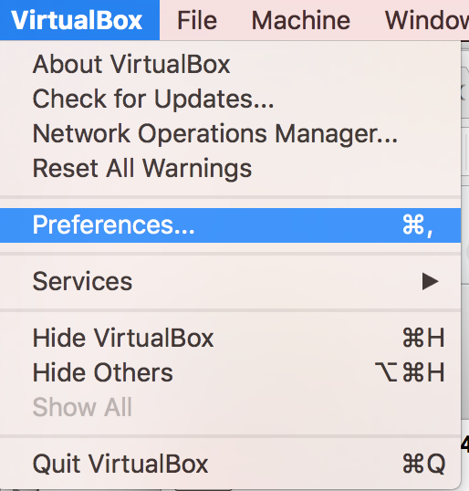
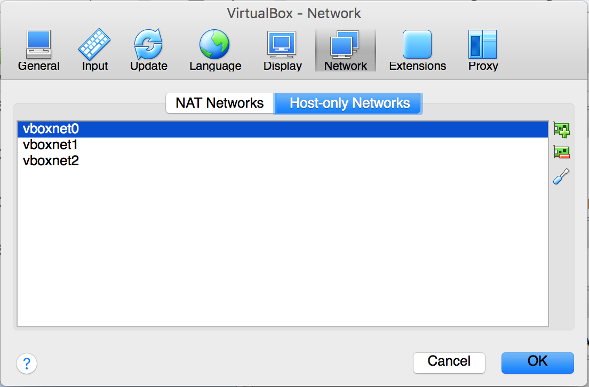
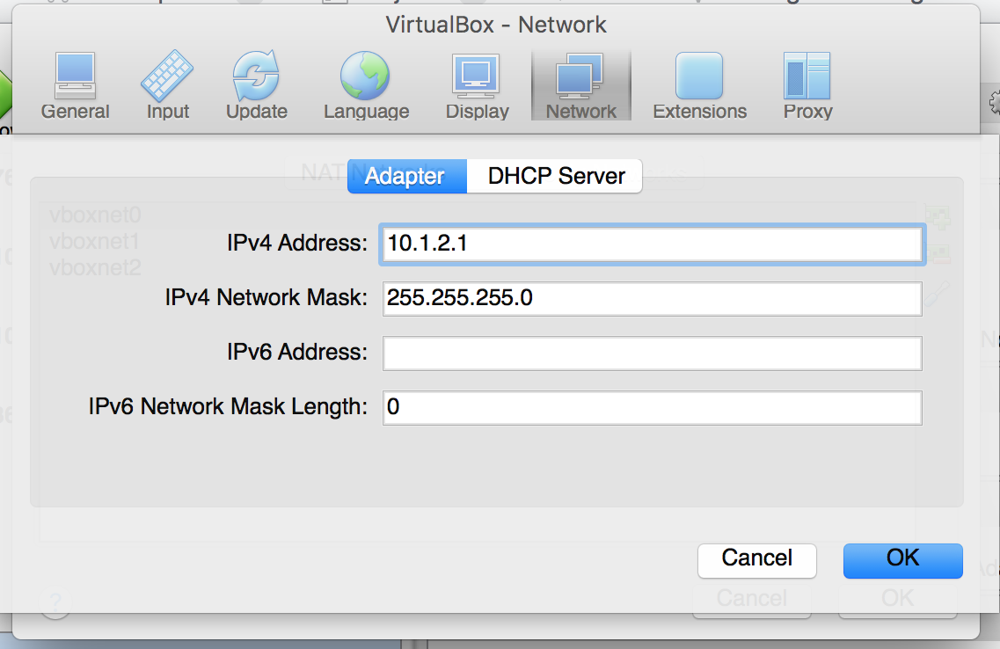
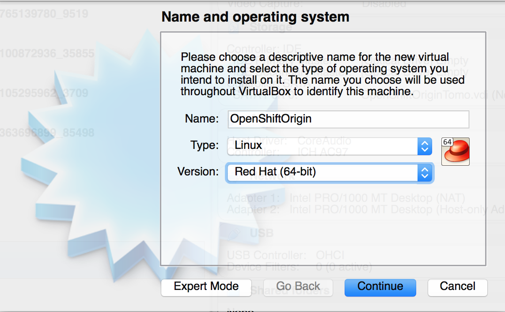
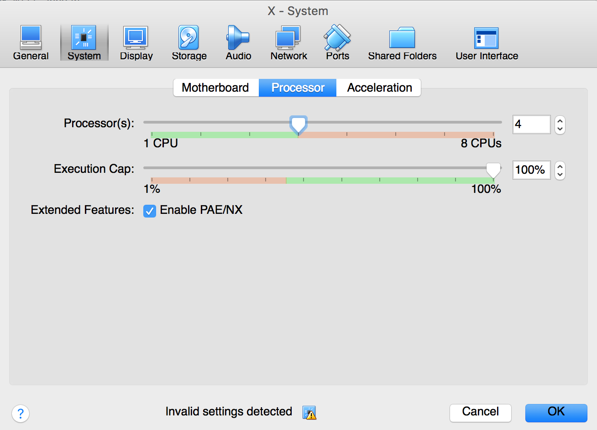
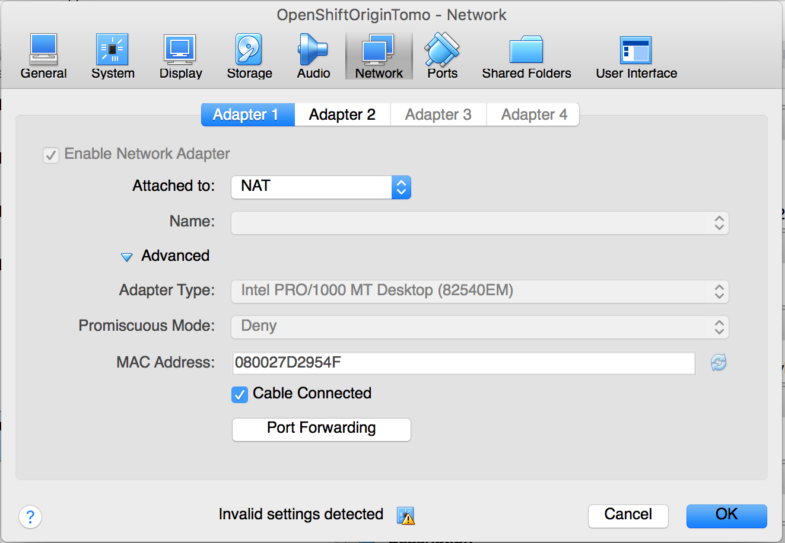
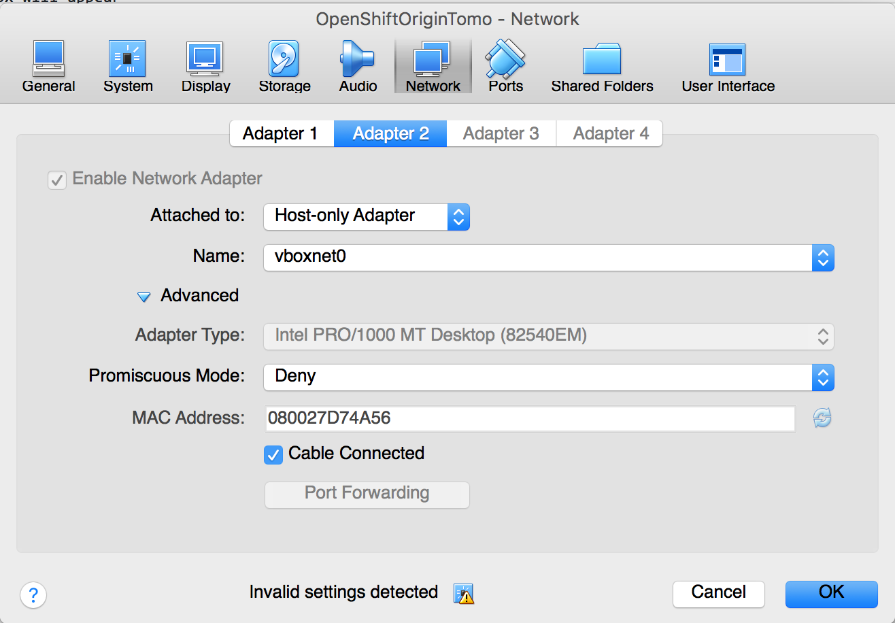
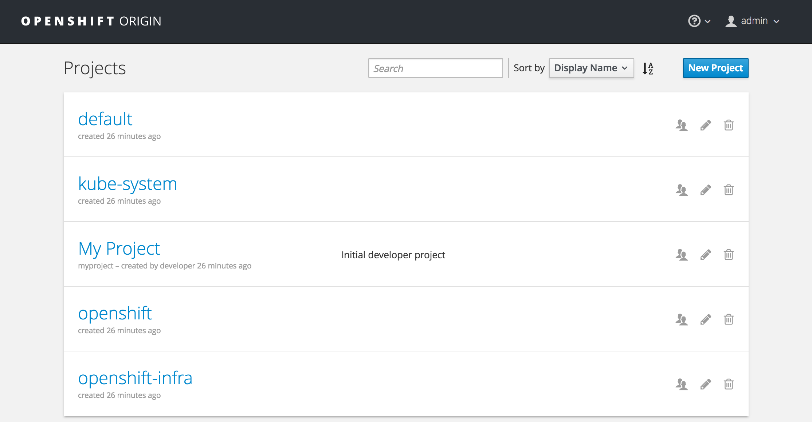

# How to Install OpenShift Origin in one node Using Ansible for Development Purposes

## Assumptions:

- CentOS operating System running as a VM in virtual box.
- Download CentOS from here: http://isoredirect.centos.org/centos/7/isos/x86_64/CentOS-7-x86_64-Everything-1611.iso

## Create a Host-Only Network in VirtualBox
- Navigate to VirtualBox->Preferences



- A dialog box will appear



- Add a host-only network and set it's IP address to 10.1.2.1.



- Click OK

## Install CentOS
- Using VirtualBox, click the Create button



- specify the name. The version should be Red Hat (64-bit)
- Allocate at least 8 GB RAM, 4 CPU




- Configure the Network. Set the first adapter to NAT



- Set the second adapter to the host-only network you created earlier



## Configure CentOS

- Once installation is complete, configure the networking inside CentOS. As root edit the file /etc/sysconfig/network-scripts/ifcfg-enp0s3 and set it to these contents

```
TYPE=Ethernet
BOOTPROTO=dhcp
DEFROUTE=yes
PEERDNS=yes
PEERROUTES=yes
IPV4_FAILURE_FATAL=no
IPV6INIT=yes
IPV6_AUTOCONF=yes
IPV6_DEFROUTE=yes
IPV6_PEERDNS=yes
IPV6_PEERROUTES=yes
IPV6_FAILURE_FATAL=no
IPV6_ADDR_GEN_MODE=stable-privacy
NAME=enp0s3
DEVICE=enp0s3
ONBOOT=yes
ZONE=public
```
- As root create a file /etc/sysconfig/network-scripts/ifcfg-enp0s8 and set it's contents to the below:

```
TYPE=Ethernet
BOOTPROTO=none
IPV4_FAILURE_FATAL=no
IPV6INIT=yes
IPV6_AUTOCONF=yes
IPV6_FAILURE_FATAL=no
IPV6_ADDR_GEN_MODE=stable-privacy
NAME=enp0s8
DEVICE=enp0s8
ONBOOT=yes
IPADDR=10.1.2.2
ZONE=public
```
- reboot the virtual machine to make sure the network settings work. After the reboot, test if you can ping yahoo.com:

```
[root@openshift sysconfig]# ping yahoo.com
PING yahoo.com (98.139.180.149) 56(84) bytes of data.
64 bytes from ir1.fp.vip.bf1.yahoo.com (98.139.180.149): icmp_seq=1 ttl=63 time=227 ms
64 bytes from ir1.fp.vip.bf1.yahoo.com (98.139.180.149): icmp_seq=2 ttl=63 time=228 ms
^C
--- yahoo.com ping statistics ---
2 packets transmitted, 2 received, 0% packet loss, time 1001ms
rtt min/avg/max/mdev = 227.997/228.146/228.295/0.149 ms
```
- From the host machine, you should be able to ping the VM ip 10.1.2.2. Otherwise, wait awhile, at the VM's Power button, found at the upper right of the console, make sure that the 'Ethernet(enp0s8)' is connected. 

```
Red-Hats-MacBook-Pro:~ bcorpus$ ping 10.1.2.2
PING 10.1.2.2 (10.1.2.2): 56 data bytes
64 bytes from 10.1.2.2: icmp_seq=0 ttl=64 time=0.454 ms
^C
--- 10.1.2.2 ping statistics ---
1 packets transmitted, 1 packets received, 0.0% packet loss
round-trip min/avg/max/stddev = 0.454/0.454/0.454/0.000 ms
```
## Install docker

```
yum install -y docker-1.13.1
```
- Edit the file /etc/sysconfig/docker and add the line 

```
INSECURE_REGISTRY='--insecure-registry 172.30.0.0/16'
```
- restart docker

```
systemctl restart docker
```

## Install required packages

```
yum install -y git unzip java-1.8.0-openjdk-headless

```

## Install Ansible

- Download ansible 2.4.3.0

```
curl https://pypi.python.org/packages/ed/84/09e8dd117081db2077cf08dbd670a3454ab0265b05e8e7f75482492b46f0/ansible-2.4.3.0.tar.gz#md5=809c90ad435bab3315d2c12fc72c9e68 -o ansible.tar.gz
tar xzf ansible.tar.gz
cd ansible-2.4.3.0/
python setup.py install
```

## Download Openshift-ansible

```
curl -L https://github.com/openshift/openshift-ansible/archive/release-3.7.zip -o openshift-ansible-release-3.7.zip
unzip openshift-ansible-release-3.7.zip
```

## Customize Ansible Hosts file

*Adapted from https://raw.githubusercontent.com/sjbylo/misc/master/ocp-install-39/create-hosts*

```
# Create an OSEv3 group that contains the master, nodes, etcd, and lb groups.
[OSEv3:children]
masters
etcd
nodes

# Set variables common for all OSEv3 hosts
[OSEv3:vars]
openshift_enable_docker_excluder=False
openshift_enable_openshift_excluder=False
ansible_ssh_user=root
ansible_become=true
#deployment_type=openshift-origin
openshift_deployment_type=origin
#debug_level=4
openshift_clock_enabled=true

openshift_master_identity_providers=[{'name': 'htpasswd_auth', 'login': 'true', 'challenge': 'true', 'kind': 'HTPasswdPasswordIdentityProvider', 'filename': '/etc/origin/openshift-passwd'}]

# Create dev and admin users
openshift_master_htpasswd_users={'dev': '$apr1$LcfsxR41$zY2JK4Bg9gXeBDKXiokRZ1', 'admin': '$apr1$f4jGxBUp$TMIBlmIVoVf9PKHWoL4w8.'}

# apply updated node defaults
openshift_node_kubelet_args={'pods-per-core': ['10'], 'max-pods': ['250'], 'image-gc-high-threshold': ['80'], 'image-gc-low-threshold': ['60']}

# AWS related configuration

#openshift_cloudprovider_kind=aws
#openshift_clusterid=cluster01   # Set this to the id of the cluster (need to tag ec2 resources) 

#openshift_cloudprovider_aws_access_key="{{ lookup('env','AWS_ACCESS_KEY_ID') }}"
#openshift_cloudprovider_aws_secret_key="{{ lookup('env','AWS_SECRET_ACCESS_KEY') }}"

# If using S3 for the Docker registry, S3 bucket must already exist.
# These vars are required 
# https://docs.docker.com/registry/storage-drivers/s3/ 
#openshift_hosted_registry_storage_kind=object
#openshift_hosted_registry_storage_provider=s3
#openshift_hosted_registry_storage_s3_bucket=ocp-registry
#openshift_hosted_registry_storage_s3_region=ap-southeast-1

# These vars are optional
#openshift_hosted_registry_storage_s3_encrypt=false
#openshift_hosted_registry_storage_s3_kmskeyid=aws_kms_key_id
#openshift_hosted_registry_storage_s3_accesskey=aws_access_key_id
#openshift_hosted_registry_storage_s3_secretkey=aws_secret_access_key
#openshift_hosted_registry_storage_s3_chunksize=26214400
#openshift_hosted_registry_storage_s3_rootdirectory=/registry
#openshift_hosted_registry_pullthrough=true
#openshift_hosted_registry_acceptschema2=true
#openshift_hosted_registry_enforcequota=true

osm_default_node_selector='env=dev'
openshift_hosted_metrics_deploy=true
#openshift_hosted_logging_deploy=true

# Disable some pre-flight checks 
openshift_disable_check=memory_availability,disk_availability,package_version

# default subdomain to use for exposed routes
openshift_master_default_subdomain=apps.10.1.2.2.nip.io

# Set the port of the master (default is 8443) if the master is a dedicated host
#openshift_master_api_port=443
#openshift_master_console_port=443

# default project node selector
osm_default_node_selector='env=dev'

# Router selector (optional)
openshift_hosted_router_selector='env=dev'
openshift_hosted_router_replicas=1

# Registry selector (optional)
openshift_registry_selector='env=dev'

# Configure metricsPublicURL in the master config for cluster metrics
#openshift_master_metrics_public_url=https://hawkular-metrics.public.10.1.2.2.nip.io

# Configure loggingPublicURL in the master config for aggregate logging
#openshift_master_logging_public_url=https://kibana.10.1.2.2.nip.io

# host group for masters
[masters]
master.10.1.2.2.nip.io

# host group for etcd
[etcd]
master.10.1.2.2.nip.io

# host group for nodes, includes region info
[nodes]
master.10.1.2.2.nip.io openshift_public_hostname="master.10.1.2.2.nip.io"  openshift_schedulable=true openshift_node_labels="{'name': 'master', 'region': 'infra', 'env': 'dev'}" ansible_connection=local
```

*Note: dev password is dev, admin password is admin*

- 
## Install OpenShift Origin

```
ansible-playbook -i /etc/ansible/hosts ~/openshift-ansible/playbooks/byo/config.yml
```

- Login as system:admin
```
oc login -u system:admin
```

- Add admin user to admin role so that all projects will be visible in the web console.

```
oc adm policy add-cluster-role-to-user cluster-admin admin
```
- Login as admin. Password is admin

```
oc login -u admin
```

- Navigate to the web console at https://10.1.2.2:8443 and login with the credentials

```
username: admin
password: admin
```
You should be able to see this:



# Congratulations! OpenShift Origin is up and running!

# Configure host directories persistent volume

```
for i in `seq 0 100`
do
  mkdir -p /var/lib/origin/openshift.local.pv/pv$i
  chcon -u system_u -r object_r -t svirt_sandbox_file_t -l s0 /var/lib/origin/openshift.local.pv/pv$i
  chmod 777 /var/lib/origin/openshift.local.pv/pv$i
done
```

- Create the PV objects in OpenShift

```
for i in `seq 0 100`
do
cat << EOF | oc create -f -
apiVersion: v1
kind: PersistentVolume
metadata:
  labels:
    volume: pv$i
  name: pv$i
spec:
  accessModes:
  - ReadWriteOnce
  - ReadWriteMany
  - ReadOnlyMany
  capacity:
    storage: 100Gi
  hostPath:
    path: /var/lib/origin/openshift.local.pv/pv$i
  persistentVolumeReclaimPolicy: Recycle
EOF
done
```
