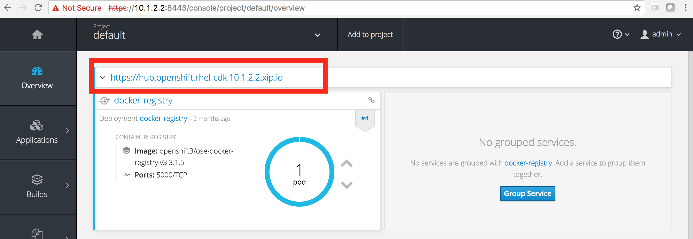
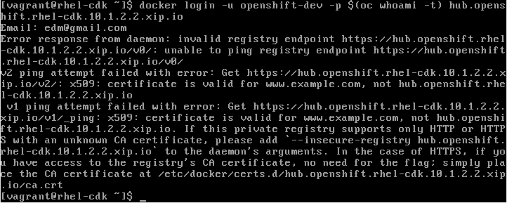
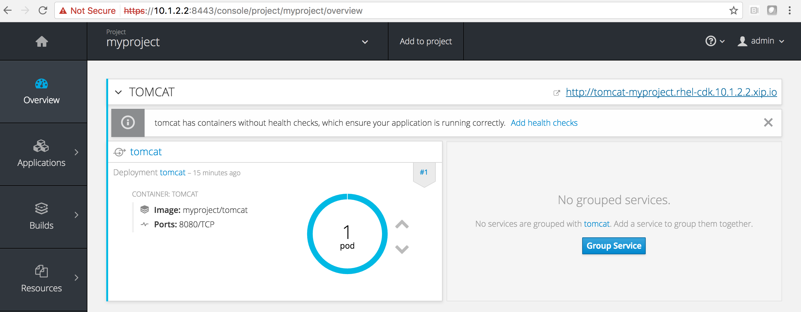
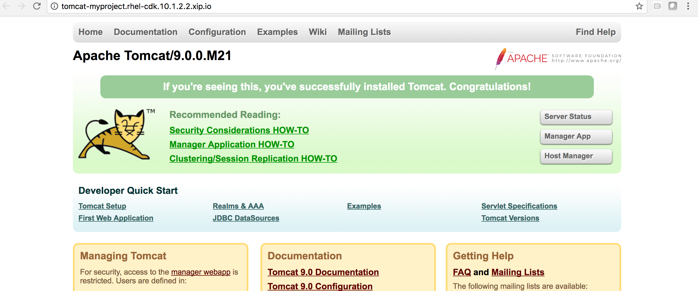

# How to run your very own docker image in OpenShift without pushing to Docker Hub.

In order to run your own Docker image, you need to push the image to OpenShift internal Docker registry.

## Assumption:
### You have a working OpenShift cluster. To setup a one-node cluster, refer to this link: https://github.com/openshift/origin/blob/master/docs/cluster_up_down.md
OR
### There is a user called openshift-dev with the following credentials:
```
username: openshift-dev
password: devel
```
# Create a docker image using the following Dockerfile:

```bash
$ cat Dockerfile

FROM centos:latest
RUN yum install -y java-1.8.0-openjdk-devel
RUN yum install -y unzip
RUN adduser tomcat
ADD tomcat.zip /home/tomcat
RUN cd /home/tomcat && unzip tomcat.zip && mv apache-tomcat-7.0.82 tomcat
RUN cd /home/tomcat/tomcat/bin && chown -R 1000:1000 /home/tomcat &&  chmod a+x *.sh && chmod -R a+rxw /home/tomcat
EXPOSE 8080
USER 1000
ENTRYPOINT cd /home/tomcat/tomcat/bin && ./catalina.sh run
```
## Build a docker image
```bash
$ docker build -t myproject/tomcat .
```
In the command above, the image tag is myproject/tomcat.

## Check that your image is already in the list

```bash
[vagrant@rhel-cdk tomcat]$ docker images|grep tomcat
myproject/tomcat                                              latest              5f174c0409aa        2 hours ago         517.5 MB
```

## Login as openshift-dev

```bash
oc login -u openshift-dev -p devel
```

## Create a new project. In this example, we call this project "myproject". When prompted for Email, enter any valid email.

```bash
[vagrant@rhel-cdk master]$ oc new-project myproject
Now using project "myproject" on server "https://10.1.2.2:8443".

You can add applications to this project with the 'new-app' command. For example, try:

    oc new-app centos/ruby-22-centos7~https://github.com/openshift/ruby-ex.git

to build a new example application in Ruby.
```
## Login to docker 

The URL of the OpenShift internal registry is hub.openshift.rhel-cdk.10.1.2.2.xip.io. To determine the URL of your internal Openshift Docker registry, go to the OpenShift console( https://10.1.2.2:8443/console/ )->default and look at the Docker registry route as shown in the red box below:



```
[vagrant@rhel-cdk tomcat]$ oc get routes -n default

```

This step might be needed. Best to add to your /etc/hosts file.

```
[vagrant@rhel-cdk tomcat]$ sudo vi /etc/hosts
    add on the last line; 10.1.2.2 hub.openshift.rhel-cdk.10.1.2.2.xip.io
    save, then ping hub.openshift.rhel-cdk.10.1.2.2.xip.io
```
If you get a certificate error, like the below:



edit your /etc/sysconfig/docker file and add the following:

```
[vagrant@rhel-cdk tomcat]$ sudo vi /etc/sysconfig/docker
```
```INSECURE_REGISTRY='--insecure-registry hub.openshift.rhel-cdk.10.1.2.2.xip.io'```

Restart docker:

```
[vagrant@rhel-cdk tomcat]$ sudo systemctl restart docker
```

```
[vagrant@rhel-cdk tomcat]$ docker login -u openshift-dev -p $(oc whoami -t) hub.openshift.rhel-cdk.10.1.2.2.xip.io
WARNING: login credentials saved in /home/vagrant/.docker/config.json
Login Succeeded
``` 
## Tag your image so that it contains the URL of the internal docker registry and the project name "myproject"

```bash
[vagrant@rhel-cdk master]$ docker tag myproject/tomcat hub.openshift.rhel-cdk.10.1.2.2.xip.io/myproject/tomcat
[vagrant@rhel-cdk master]$ docker push hub.openshift.rhel-cdk.10.1.2.2.xip.io/myproject/tomcat
The push refers to a repository [hub.openshift.rhel-cdk.10.1.2.2.xip.io/myproject/tomcat]
a682f6ed0658: Pushed 
b481041927bf: Pushed 
ee434c86fe87: Pushed 
93bc0aef485b: Pushed 
9bffbd5a8942: Pushed 
f82048aca1ad: Pushed 
36018b5e9787: Pushed 
latest: digest: sha256:05f929a0deee05b2000ad3bae60e5db478577e2a18264745464e21b7f4a45efb size: 7424
```
## Create a new application based on your image. In this case, our image is tomcat:

```bash
[vagrant@rhel-cdk tomcat]$ oc new-app tomcat
--> Found image 434f6a1 (2 hours old) in image stream tomcat under tag "latest" for "tomcat"

    * This image will be deployed in deployment config "tomcat"
    * Port 8080/tcp will be load balanced by service "tomcat"
      * Other containers can access this service through the hostname "tomcat"

--> Creating resources with label app=tomcat ...
    deploymentconfig "tomcat" created
    service "tomcat" created
--> Success
    Run 'oc status' to view your app.
```

## Create a route for your application

```bash
[vagrant@rhel-cdk tomcat]$ oc expose svc tomcat
route "tomcat" exposed
```
## View your application from the OpenShift console



## View your application from the browser



## That's it!

